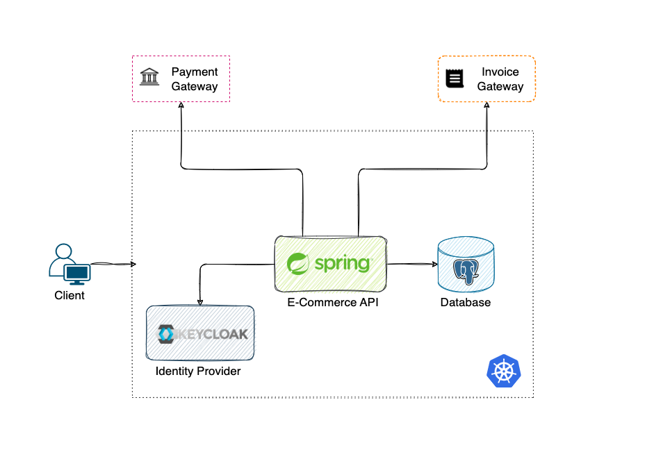
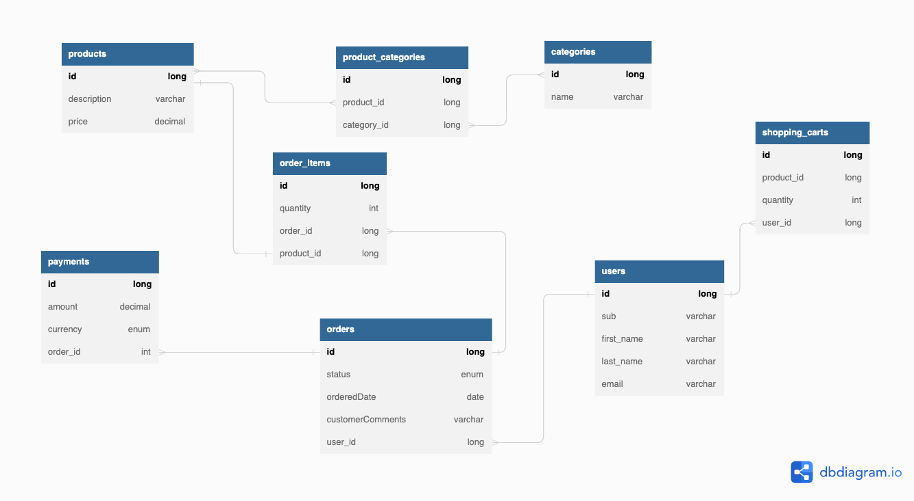

## E-Commerce

### Overview

Another E-Commerce project used to learn and practice a wide range of best practices and tools.
I am going to apply best practices, design patterns, clean code, SOLID principles, TDD, DDD, CI/CD and many more.

:dancers: Hands-On with Spring JPA, Hibernate, Transactions, SQL

### Documentation

The E-Commerce documentation, diagrams, schemas, notes can be found
here [.documentation](https://github.com/DragomirAlin/e-commerce/tree/main/.documentation)

### High-level description

The provided services are:
| Service | Description |
|--------------------------- |-------------------------------------------------------------------------------------- |
| **User service**            | handles the user's data and billing information |
| **Product service**        | handles the products catalog(create, delete, update, retrieve)                        |
| **Shopping cart service**    | handles the user's shopping cart(persist the items, update, delete, checkout) |
| **Order service**            | handles the user's orders(create order from shopping cart, update, delete, retrieve) |
| **Payment service**        | handles the orders' payments using external services(Stripe, PayPal, BTPay)            |
| **Category service**        | handles the products categories(relation between products and categories) |
| **Notification service**        | send notifications to customers via Email |
| **Storage service**        | storage service for storing invoices, emails (S3 backend storage) |

### Project Planning

I'm going to build a monolithic application with Hexagonal Architecture, and then I'm going to split it into
microservices.
Detailed planning can be found here:

- [Planning](./documentation/planning.md)
- [E-Commerce Kanban](https://github.com/DragomirAlin/spring-transactions/projects/1)

1. Phase 1 ***(current)***
   Create a monolith application
2. ~~Phase 2
   Fork this repository and split the monolith into microservices.~~ Keep the monolith to give the advantage of Hexagonal Architecture. (for microservice architecture, check [smartfactory](https://github.com/DragomirAlin/smartfactory) project)

### Architecture

**Hexagonal Architecture**, also known as “**Ports and Adapters Pattern**”, is an architectural pattern exposed by
Alistair
Cockburn which applies the Anti-corruption Layer DDD Pattern in a very effective way. The concept is very simple: the
domain model communicates with the external world using interfaces as ports. Every external module that wants to
communicate with the domain builds an adapter and attaches it to the port.

| Layer      |                   Module                    |                             Depends on |
|------------|:-------------------------------------------:|---------------------------------------:|
| domain     |      ro.dragomiralin.ecommerce.domain       |                                      - |
| boot       |       ro.dragomiralin.ecommerce.boot        | domain, repository, controller, client |
| client     |      ro.dragomiralin.ecommerce.client       |                                 domain |
| repository | ro.dragomiralin.ecommerce.infra.persistence |                                 domain |
| controller |  ro.dragomiralin.ecommerce.infra.api.rest   |                                 domain |

### Data Modelling

[E-Commerce Data Model](./documentation/dbdiagram.md)

### Technologies
- Java 17
- Spring Boot, Spring Data JPA, Redis, Spring Security, Spring Cloud
- MapStruct, Lombok, Swagger 3, Micrometer
- Maven multi-module
- JUnit 5, Mockito, TestContainers
- PostgreSQL, Redis

### Deployment
- Kubernetes
- ArgoCD (GitOps)
- Helm Charts
- Istio

### Monitoring
- Prometheus
- Grafana

### CI/CD
- GitHub Actions
- ArgoCD (GitOps)
- Helm Charts

### Code Quality & Security
- SonarQube
- SonarCloud

### Infrastructure Provisioning
- Terraform

### References and further reading

References and documentation used to build this project can be found here:

#### Architecture & Design

- [https://microservices.io/](https://microservices.io/)
- [https://12factor.net/](https://12factor.net/)

#### Persistence

- [Transaction Management](https://docs.spring.io/spring-framework/docs/4.2.x/spring-framework-reference/html/transaction.html#:~:text=The%20Spring%20Framework%20provides%20a,Java%20Data%20Objects%20(JDO).)

