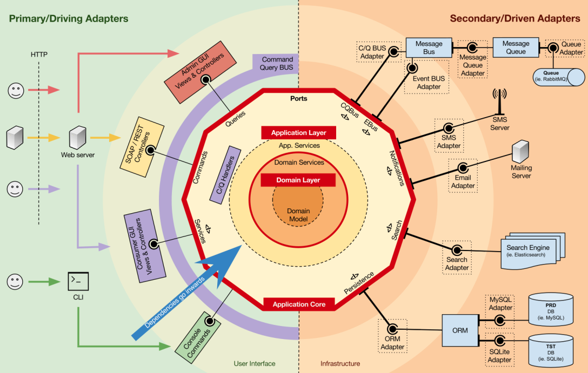

# 1. Architecture
 - [Hexagonal Architecture](https://en.wikipedia.org/wiki/Hexagonal_architecture)
 
I'm going to document all the steps of developing this application.
1. Architecture/Design
2. Tools and Dependencies
3. Best Practices / Design Patterns / Approaches
4. Data Model
5. Development

## Hexagonal Architecture
**Hexagonal Architecture**, also known as “Ports and Adapters Pattern”, is an architectural pattern exposed by Alistair Cockburn which applies the Anti-corruption Layer DDD Pattern in a very effective way. The concept is very simple: the domain model communicates with the external world using interfaces as ports. Every external module that wants to communicate with the domain builds an adapter and attaches it to the port.

I chose Hexagonal Architecture because it provides a loose coupling between components and a high-level of abstraction.

The Hexagonal Architecture, also referred to as Ports and Adapters.
The input goes through at a Port via an Adapter and the output is sent from the application through a Port to an Adapter.

### Port
A port is an entry point which determines the interface with which other components will interact.

**tips:**
- a Port should always have 2 items hooked to it, one being always a test

### Adapter
An adapter initiates the interaction with application through a port. 

The Hexagonal Architecture advantages:
1. Swapping data sources (e.g. JSON API, GraphQL, etc.)
2. Changing technology with a lower impact
3. Test business logic in isolation from external systems

